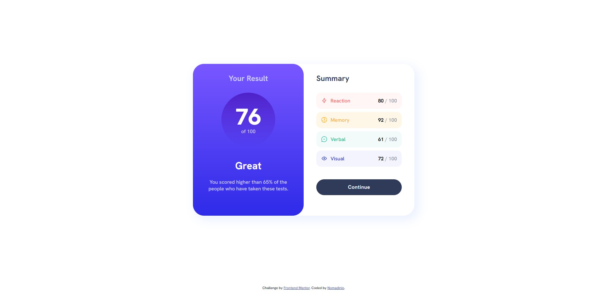

# Frontend Mentor - Results summary component solution

This is a solution to the [Results summary component challenge on Frontend Mentor](https://www.frontendmentor.io/challenges/results-summary-component-CE_K6s0maV). Frontend Mentor challenges help you improve your coding skills by building realistic projects.

## Table of contents

- [Overview](#overview)
  - [The challenge](#the-challenge)
  - [Screenshot](#screenshot)
  - [Links](#links)
- [My process](#my-process)
  - [Built with](#built-with)
  - [What I learned](#what-i-learned)
  - [Continued development](#continued-development)
- [Author](#author)

## Overview

### The challenge

Users should be able to:

- View the optimal layout for the interface depending on their device's screen size
- See hover and focus states for all interactive elements on the page

### Screenshot

### Links

- Solution URL: [Add solution URL here](https://your-solution-url.com)
- Live Site URL: [Add live site URL here](https://nomadinio-results-summary-component.netlify.app/)

## My process

### Built with

- HTML5
- CSS
- Flexbox
- SASS

### What I learned

I have recaped some basics of HTML and CSS by doing this challenge. Learned to add svg icons properly, had some issues with aligning them to the text in paragraphs.

### Continued development

In upcoming projects I will definately start by doing mobile version first. I haven't done it here and lost too much time fixing the code.

## Author

- Frontend Mentor - [@Nomadinio0](https://www.frontendmentor.io/profile/Nomadinio0)
